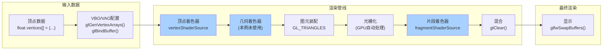

#-DVCPKG_TARGET_TRIPLET=x64-windows-static
### OpenGL对象创建：
发现OpenGL对象的创建有点类似读文件。也要执行系统调用，返回标识符（句柄）。仔细想也确实类似，都是要驱动程序去做中断处理的。
```cpp
// ===== 1. 资源的创建 =====
// OpenGL对象的创建有点类似读文件。也要执行系统调用，返回标识符（句柄）。仔细想也确实类似，都是要驱动程序去做中断处理的。
GLuint vao;                      // 声明一个VAO句柄
glGenVertexArrays(1, &vao);      // 从OpenGL获取一个VAO句柄

// 文件系统
int fd;                          // 声明一个文件描述符(句柄)
fd = open("file.txt", O_RDWR);   // 从系统获取一个文件标识符(句柄)

// ===== 2. 资源的使用 =====
// OpenGL对象绑定
glBindVertexArray(vao);          // 绑定VAO为当前上下文
// 之后所有的顶点属性配置都会存储在这个VAO中

// 文件操作
lseek(fd, 0, SEEK_SET);         // 设置文件指针位置
// 之后的read/write操作都会从这个位置开始

// ===== 3. 资源的释放 =====
// OpenGL对象删除
glDeleteVertexArrays(1, &vao);   // 删除VAO，释放显存资源

// 文件关闭
close(fd);                       // 关闭文件，释放系统资源

```
### 利用glad提供函数指针
​	glGenVertexArrays 在这种情况下是一个函数指针，指向一个具体的函数实现。
**函数指针**：glGenBuffers 是一个指针变量，存储了函数的地址。指针存储在数据段或栈中，保存了函数实现的地址
**函数实现**：wglGetProcAddress("glGenBuffers") 返回了 glGenBuffers 函数的地址，这个地址指向了显卡驱动程序中的具体实现。并且具体实现存储在代码段中，具体的函数代码由显卡驱动程序提供。
​	如果不用glad，每个这样的指针，由于显卡的不同，都要进行手动的运行时重定位，查找重定位后的函数位置。所以利用glad把所有有用的函数的位置找好。

### SFML类
#### 循环中 Event类
用于侦测每次循环时发生的事件，例如鼠标点击、键盘按键等。pollEvent()函数用于获取事件，如果有事件发生，返回true，否则返回false。
似乎是一个事件队列，每次pollEvent()都会返回队列中的一个事件，直到队列为空。
根据这种设计完全可以设置一个按键类，用于处理不同按键的对应事件。
```cpp
sf::Event event;
while (window.pollEvent(event)) {
    if (event.type == sf::Event::Closed) {
        window.close();
    }
}
```



### 
